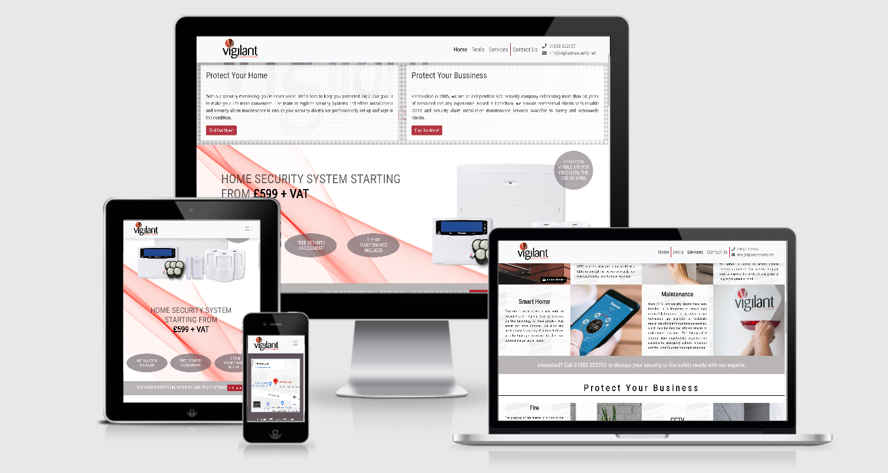
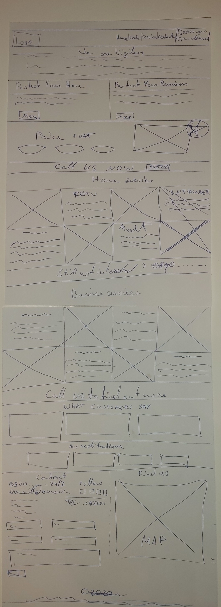
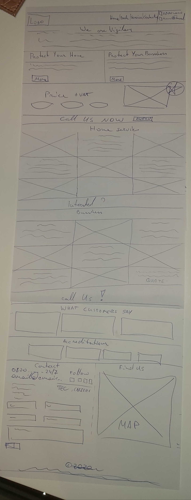
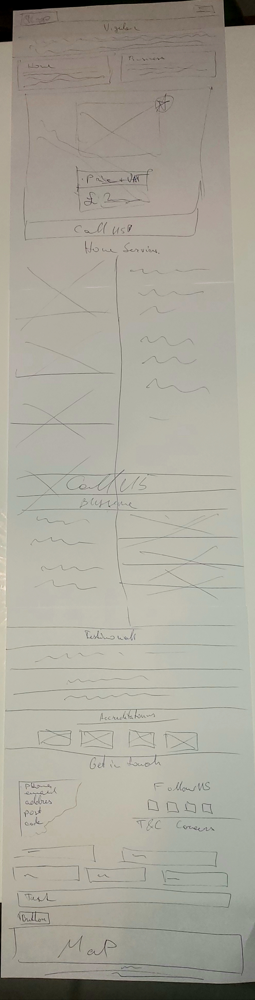
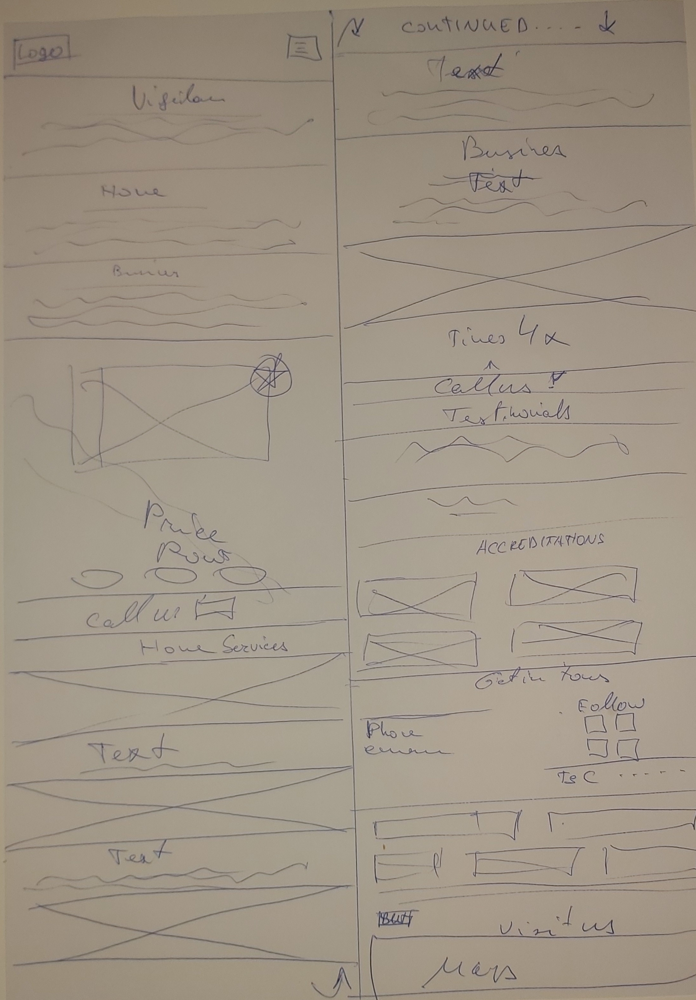

# Vigilant Security Systems Ltd

A live demo can be found here: https://grimsas.github.io/MS1/

Do you need brand-new security alarms to protect your Caterham, Banstead, Oxted or Warlingham property? Our experienced security company carries out installations and security alarm maintenance for domestic and commercial clients throughout the UK. Our fully-qualified technicians are available on an emergency basis for jobs at small to large-scale properties – from apartments and estates to offices and industrial warehouses. We also provide free advice about a range of security alarms, plus obligation-free consultations.

## UX
The purpose of this project is to create a static website for an installer of security systems, as the existing website http://www.vigilantsecurity.co.uk/ is visually unpleasing, unresponsive and did not attract potential customers attention.

My goal was to make the website as simple as possible, with responsive page layout, providing brief services overview, deals, contact form and other means of communication and a physical address to visit.

## Features

The website uses Bootstrap 4 and due to design and responsiveness had to add custom @media queries sizes as some responsive features didn't scale. All external links open on the new tab. Some text use calc() function to scale to screen size and prevent unwanted wrap or overflow.

### Navbar

Navbar responsiveness achieved with Bootstrap. At first, I've tried to use skewed menu items, but due to visual inconsistency left them at 0 degrees. Menu items use borders on one side on the large screens, and on the bottom on the small to medium screens, this achieved through @media queries and adding borders to the :nth-childs. Large screens have the shadow on menu item hover, and smaller screens go transparent. Also, navbar gives visual scroll 'location' with the help of 'scrollspy'.

### Home

Basic cards with a brief company and services provided a description. Quick links to redirect to Home and Business content. The background image is overlayed with a pattern image.

### Deals

A deal section has two images, as it doesn't scale, I've used hide and show on specific breakpoints, so it will be consistent with the device size. Also, text position, size and layout are different on various screens sizes.

### Services

For services, I've used 'tiles' design, and on every breakpoint, it changes the layout, i.e. xlarge is 4 in the row, large is 3,  medium is 2 and small 1 tile. I have created a 'dummy' tile, which is visible on the large screen only to preserve layout consistency.

### Contact Us

Contact us has an enquiry form, Map, Adress, phone and email, and dummy copyright information. 

## Technologies Used

1.HTML  
2.CSS   
3.Bootstrap 4   

## Testing

Is it Mobile Friendly? Yes, according to the Google Test Tool: https://search.google.com/test/mobile-friendly?id=VSx_HbNf0Y7hpI-Ax97P3w

Both https://validator.w3.org/ and https://jigsaw.w3.org/css-validator/ found no errors, although CSS validator shows some warnings for using the same background and border colour, and for 'unknown' vendor extensions.

Tested on: Win10: Crome80, MS Edge, Firefox 74, Samsung A70, OnePlus 5, Lenovo Yoga Tablet 2 android Chrome. During testing found that the sticky-top function does not work on MS Edge and it holds the last position when the menu item was clicked, fixed with fixed-top class.

Also found that the Linux environment is case sensitive and had to rename files and folders so it would work on remotely deployed site (GitHub pages), but it worked fie on IONOS Linux deployment.

## Known Issues/Bugs

MS Edge smooth-scroll doesn't work.   
Map height is not responsive. 

## Feature Change/Left to Implement

Navbar: NA
Home: Split into two categories and create a full width-height Hero image
Deals: Simplify banner and add content with HTML and CSS instead on the image and make a user-controllable carousel
Services: Add 'Find More...' and link to the page with more info about the subject.
Testimonials: Add live feed and make as the carousel.
Footer: implement postcode, city, email validators. Include T&C, Careers, Policies pages. As for now, they are just placeholders. Make a map responsive again. 

## Credits

https://unsplash.com/ - For providing the possibility to use images    
https://texe.com/ - For providing the possibility to use images     
https://www.w3schools.com - For the idea of how to solve various issues.
https://getbootstrap.com Bootstrap - for very detailed Documentation     

## Mockups

### Reused Code: 
Link disablement from here : https://css-tricks.com/how-to-disable-links/   
image overlay: https://divinotes.com/overlay-your-images-with-a-pattern-or-translucent-color/
